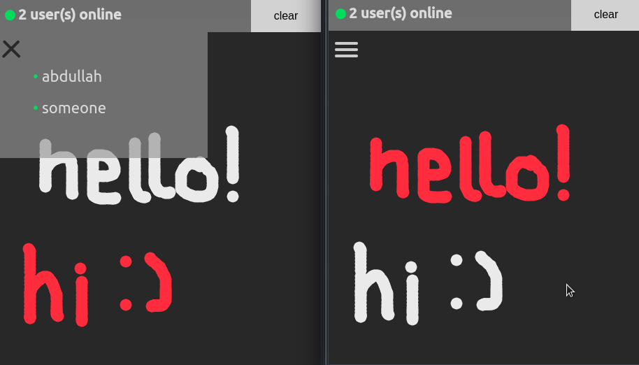

# CollabCanvas
An online canvas on which multiple users can draw on together, in real-time.

CollabCanvas was built using [Node.js](https://nodejs.org/en/) along with [Socket.io](https://socket.io) and [p5.js](https://p5js.org/)
___
## Demo:

## Running
If you'd like to run this app:
- `git clone https://github.com/abdullah-K/CollabCanvas`.
- run `npm install`.
- run `node server.js` and visit [localhost:3030](http://localhost:3030).
- have fun!
